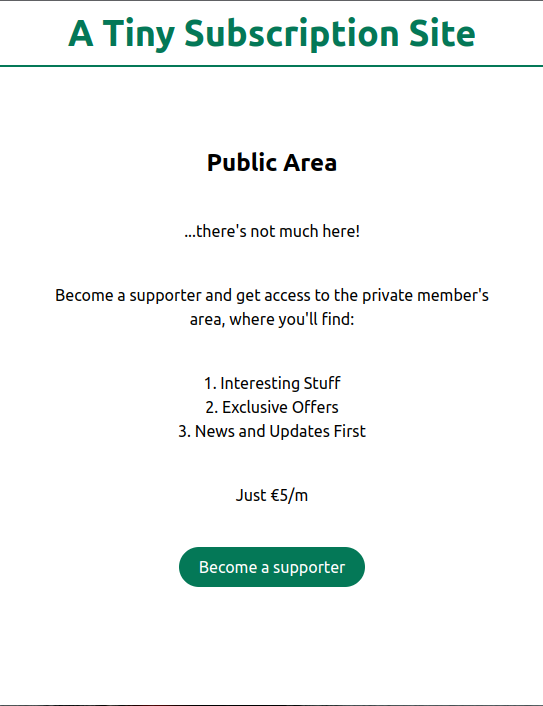
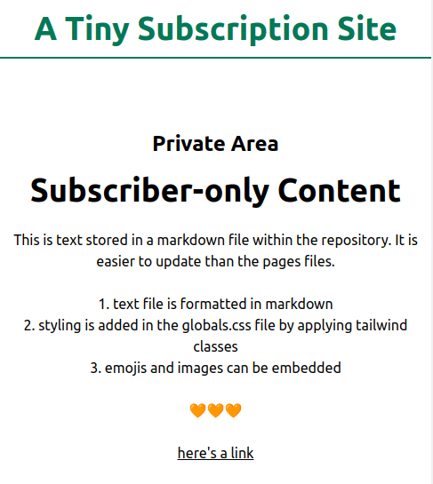

A [tutorial](https://github.com/flaviocopes/bootcamp-2022-week-17-privatearea) by [Flavio Copes](https://github.com/flaviocopes).

-   Next.js with postgres database and Prisma ORM
-   Basic information available on public page
-   Sign up using next-auth
-   Subscription option for additional content
-   Payment processing using Stripe
-   Subscribers automatically routed to members area
-   Markdown file processed using gray-matter and remark to display as html on page

main page

members area
